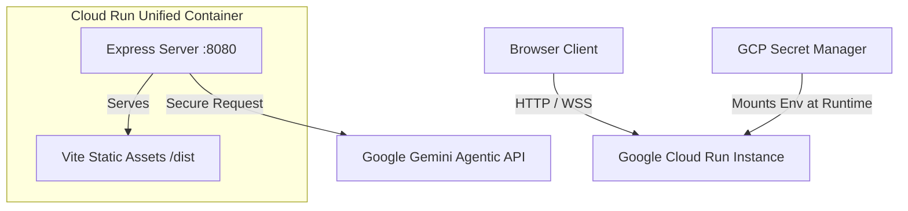

# ClauseGuard AI — Google Cloud Run Deployment Guide

This guide describes how to compile, containerize, and deploy the full-stack ClauseGuard AI application to **Google Cloud Run** with a single unified Docker build. 

The build pipeline has been optimized with a multi-stage `Dockerfile` that packages both the Vite React frontend and the Express Node.js backend into a single, high-performance production-ready container image (<150MB).

---

## Architecture Overview



---

## Prerequisites

Before beginning, ensure you have the following installed and configured:
1. **Google Cloud SDK (gcloud CLI)**: Installed and authenticated.
2. **GCP Project**: A Google Cloud Platform project with billing enabled.
3. **IAM Permissions**: Owner or Editor role on the target GCP project.

---

## Step 1: Initialize Google Cloud Configuration

Authenticate your CLI and set your target GCP Project:

```bash
# Log in to your Google Account
gcloud auth login

# Set your active GCP project ID
gcloud config set project YOUR_GCP_PROJECT_ID

# Enable the required GCP Services APIs (Run, Artifact Registry, Build)
gcloud services enable \
  run.googleapis.com \
  artifactregistry.googleapis.com \
  cloudbuild.googleapis.com
```

---

## Step 2: Create Artifact Registry

Create a secure Docker repository in Google Artifact Registry to house your ClauseGuard container images:

```bash
# Create a repository named "clauseguard-repo" in your preferred region (e.g., us-central1)
gcloud artifacts repositories create clauseguard-repo \
  --repository-format=docker \
  --location=us-central1 \
  --description="ClauseGuard AI container images"
```

---

## Step 3: Configure Docker Authentication

Configure your local Docker daemon or Cloud Build to authenticate with Google Artifact Registry:

```bash
gcloud auth configure-docker us-central1-docker.pkg.dev
```

---

## Step 4: Build and Push Image using Google Cloud Build

You do not need to have Docker installed locally! Google Cloud Build can securely build your multi-stage container directly in the cloud from your source directories:

```bash
# Execute Cloud Build to build and push to Artifact Registry
gcloud builds submit --tag us-central1-docker.pkg.dev/YOUR_GCP_PROJECT_ID/clauseguard-repo/clauseguard-app:latest
```

---

## Step 5: Deploy to Google Cloud Run

Deploy the uploaded image to Cloud Run. Make sure to pass your `GEMINI_API_KEY` securely. 

### Option A: Via Environment Variables (Fastest)

```bash
gcloud run deploy clauseguard-ai \
  --image us-central1-docker.pkg.dev/YOUR_GCP_PROJECT_ID/clauseguard-repo/clauseguard-app:latest \
  --region us-central1 \
  --platform managed \
  --allow-unauthenticated \
  --set-env-vars="GEMINI_API_KEY=your_gemini_api_key_here"
```

### Option B: Via GCP Secret Manager (Most Secure / Recommended for Production)

1. Create the secret in GCP Secret Manager:
   ```bash
   # Create a new secret metadata reference
   gcloud secrets create GEMINI_API_KEY --replication-policy="automatic"

   # Add your API key as a secret version
   echo -n "your_gemini_api_key_here" | gcloud secrets versions add GEMINI_API_KEY --data-file=-
   ```

2. Deploy to Cloud Run referencing the secret:
   ```bash
   gcloud run deploy clauseguard-ai \
     --image us-central1-docker.pkg.dev/YOUR_GCP_PROJECT_ID/clauseguard-repo/clauseguard-app:latest \
     --region us-central1 \
     --platform managed \
     --allow-unauthenticated \
     --update-secrets=GEMINI_API_KEY=GEMINI_API_KEY:latest
   ```

---

## Step 6: Verify Deployment

Once the deployment completes, the gcloud CLI will output your live URL:

```text
Service [clauseguard-ai] revision [clauseguard-ai-00001-abc] has been deployed and is serving 100% of traffic.
Service URL: https://clauseguard-ai-xyzw-uc.a.run.app
```

Navigate to the provided **Service URL** in your browser to view your live, fully functional, production-hardened **ClauseGuard AI** dashboard!

---

## Local Container Testing (Optional)

If you wish to test your Docker container locally before deploying:

```bash
# Build local image
docker build -t clauseguard-app:local .

# Run local container mapping port 8080 (backend) to local 3001
docker run -p 3001:8080 -e GEMINI_API_KEY="your_actual_key" clauseguard-app:local

# Open http://localhost:3001 in your browser
```
